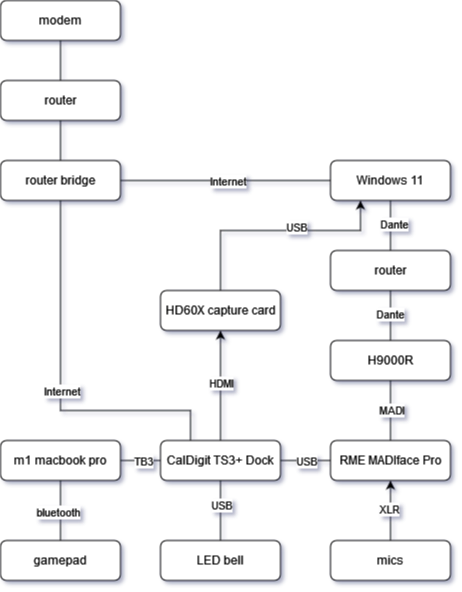

This repository stores essential backup files for Sousastep's rig.
It should be cloned to C:\Users\jbayl\Music\ on the streaming PC.

"streaming_start.bat" makes it easy to start all the apps needed for streaming.

The H9000 should have its MADI expansion card in slot C, and its Dante expansion card in slot A.
"stereo pitch correction.sig2" should be uploaded to H9000 algorithm slot #10119
"Chorusdelaysends.sig2" should be uploaded to H9000 algorithm slot #10101
Then "stereo pitch correction.9kp", "Chorusdelaysends.9kp",
and "Eventide_H9000_session_backup.9ks" may be uploaded.

"TotalMix_workspace_backup.tmws" is for the discontinued RME MADIface Pro.
"Dante_Controller_settings_backup.xml" is for Dante running on Windows with Dante Via.

H9K_to_OBS_mastering.als simply takes audio from the H9000, sends it thru Newfangled Elevate,
adds render delay with "delay 180 samples.amxd" because Iriun Webcam has a ton of delay,
and sends it to OBS.

